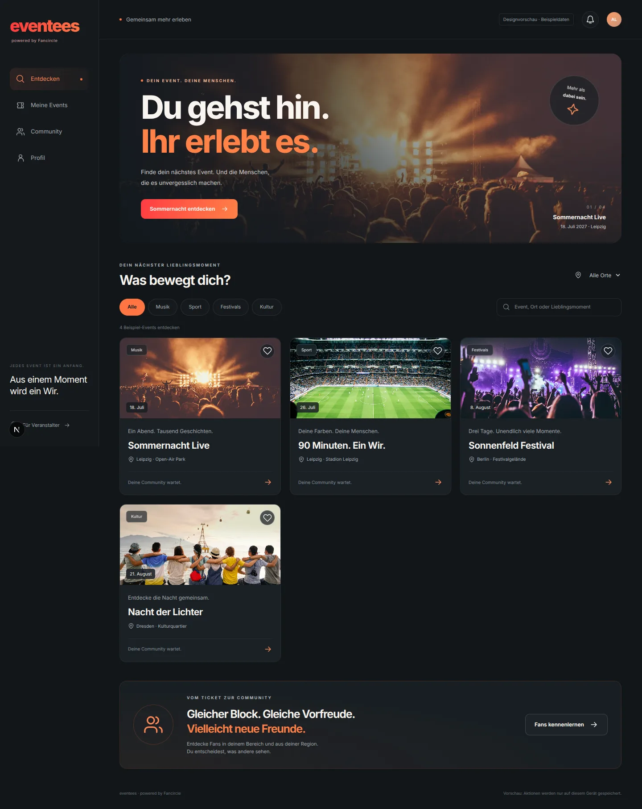
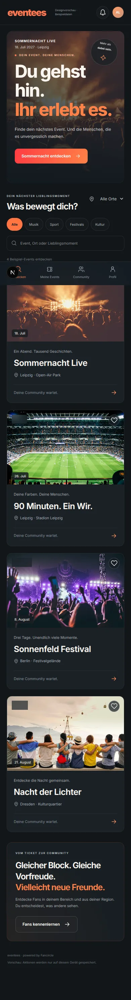
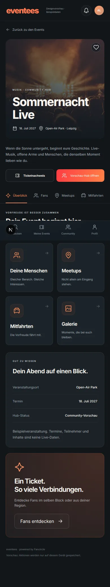
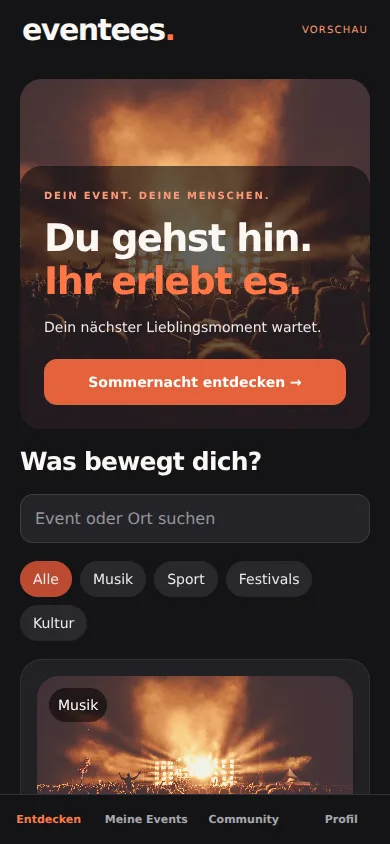

# eventees — Entwicklungsstand

Aus Fancircle EventHub entsteht eventees: öffentliche Events entdecken, mit Ticket Zugang erhalten und Menschen im selben Event kennenlernen. Diese Branch enthält eine bedienbare Vorschau und die nächste Backend-Basis. Externe Verbindungen werden separat eingerichtet.

## Ausprobieren

```sh
npm ci
npm run dev
```

Startseite: `http://localhost:3000`. Die Beispiel-Events sind ausdrücklich fiktiv. Die bestehenden Veranstalter- und Gastbereiche bleiben über ihre bisherigen Routen erreichbar.

| Bereich | Implementiert |
|---|---|
| Entdecken | Musik, Sport, Festivals, Kultur; Suche; Ortsfilter; leere Ergebnisse |
| Meine Events | Merkliste und Vorschau-Hubs, lokal gespeichert |
| Eventhub | Überblick, Fans, Meetups, Mitfahrten, Galerie, Chat |
| Fans | Gleicher Bereich, gleicher Ort, Interessen; nur freigegebene Angaben |
| Profil | Eventbezogene Sichtbarkeit; private Standardwerte; lokale Einstellungen |
| Ticket | Foto-/PDF-Auswahl, Größen- und Formatprüfung; keine automatische Freischaltung |
| Meetups | Lokales Erstellen, Beitreten und Zurücknehmen |
| Mitfahrten | Angebote/Gesuche erstellen und Interesse markieren |
| Galerie | Lokale Fotoauswahl mit Vorschau; kein Upload |
| Chat | Lokale Nachrichten; keine Übertragung |
| Native | Expo-App für iOS/Android, Entdecken, Merkliste, Fans, Profil und lokale Hub-Funktionen |

## Design

Anthrazit, Korall-Rot/Orange, große Fotografie, klare Navigation, mobile Daumennavigation, sichtbarer Fokus und reduzierte Animation bei entsprechender Systemeinstellung.






## Verifikation

- Next-Produktionsbuild und TypeScript erfolgreich.
- 7 Domain-Tests: Datenschutzprojektion, Filter, private Defaults und Ticketmetadaten.
- 10 Browsertests auf Desktop und mobilem Chromium: Suche, Merkliste mit Reload, Privatsphäre, Ticketfehler, lokale Meetups/Chat und Layout ohne Überlaufen.
- Native TypeScript und Hermes-Exports für iOS/Android erfolgreich. Native Komponenten zusätzlich im Web-Renderer auf Navigation und Merkliste geprüft, ohne JavaScript-Fehler. Noch kein Test auf echtem Gerät und keine signierten Store-Binaries.
- 57 Backend-Tests mit 155 Assertions bestehen; siehe korrespondierende Backend-Branch.

```sh
npm run test:eventees
npm run typecheck
npm run build
npx playwright install chromium
npx playwright test
cd mobile
npm ci
npx tsc --noEmit
npx expo export --platform ios --platform android
```

Die Web-Vorschau arbeitet bewusst mit Beispieldaten. `lib/eventees/api.ts` enthält den gemeinsamen typisierten API-Client für die neuen Backend-Endpunkte; er ist noch nicht in die Vorschau eingehängt. Die Browserdaten enthalten keine Ticketbilder oder Barcodes. Neue Galerieobjekte werden beim Verlassen der Seite freigegeben; Chat, selbst erstellte Meetups und Mitfahrten verschwinden beim Neuladen. Native Daten bleiben in dieser App-Sitzung.

## Nächster gemeinsamer Schritt

1. Frontend- und Backend-Branches prüfen und zusammenführen; Staging-Umgebung einrichten.
2. API-URL, Anmeldung und echte persistente Nutzerzustände verbinden.
3. Öffentlichen Eventfeed lizenzieren und einen Adapter anschließen; Katalog-Hubs an die bestehenden geschützten Community-Hubs anbinden.
4. Private Ticketablage und KI-Extraktion anschließen; Ausstellerprüfung und serverseitige Ticket-Mitgliedschaft durchsetzen.
5. Ticketshop/Affiliatepartner, verlässliche Weiterleitungen und Kennzeichnung einrichten.
6. Bestehende Chat-, Meetup-, Mitfahrt- und Medien-APIs mit dem neuen Design verbinden; Kontakte mit gegenseitiger Zustimmung in private Chats überführen.
7. Melden/Blockieren, Moderation, Löschprozesse, Benachrichtigungen und Betrugsprüfung fertigstellen.
8. Apple-/Google-Konten, App-Signierung, Gerätetests und Store-Einreichungen vorbereiten.

## Medienquellen

Die lokalen Demo-Fotos stammen von Unsplash-Bildendpunkten: `photo-1470229722913-7c0e2dbbafd3`, `photo-1522778119026-d647f0596c20`, `photo-1506157786151-b8491531f063`, `photo-1529156069898-49953e39b3ac`. Vor öffentlicher Veröffentlichung finale Marken-/Veranstalterbilder und deren Nutzungsrechte festlegen. Brand-Icons sind lokale SVG-Entwürfe; keine Event- oder Künstlerlogos werden als Partnerschaft ausgegeben.
